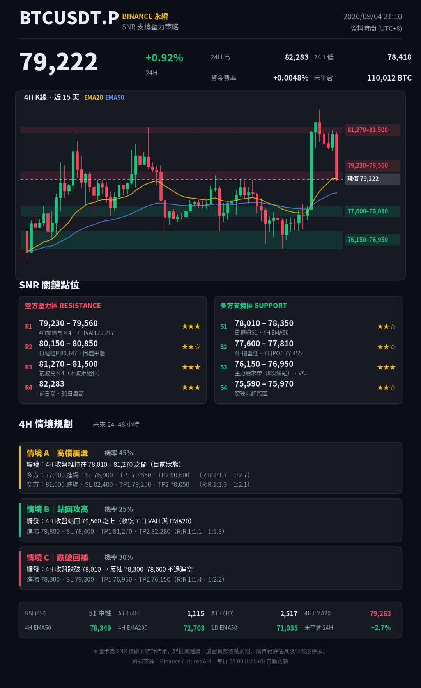

# BTCUSDT.P — SNR 每日策略圖卡

每天台北時間 **08:00** 自動抓取幣安（Binance USDT-M）BTCUSDT 永續合約行情，
用 SNR（Support & Resistance，支撐壓力）綜合版方法算出多空關鍵區帶，
產出 **4H 情境規劃**，並渲染成一張 PNG 圖卡。

整條流程跑在 GitHub Actions 上，不需要開電腦。



> 上圖為專案實際輸出範例；推上 GitHub 並跑過一次 Actions 後會自動換成當日最新版。

---

## 這張圖卡在算什麼

| 區塊 | 內容 |
|---|---|
| 標題／價格列 | 現價、24H 漲跌、24H 高低、資金費率、未平倉量 |
| 4H K 線 | 近 12 天 75 根 4H K 棒 + EMA20／EMA50 + 支撐壓力區帶 |
| SNR 關鍵點位 | 空方壓力 R1–R4、多方支撐 S1–S4，含觸碰次數、共振依據、★ 強度 |
| 4H 情境規劃 | 情境 A 區間震盪／B 向上突破／C 向下破位，含機率、觸發、進場、停損、TP、R:R |
| 指標列 | RSI(4H)、ATR(4H/1D)、4H EMA20/50/200、1D EMA50、日線結構 |

### SNR 點位怎麼來的

1. **擺盪高低點**（`snr/analyze.py::pivots`）
   4H 用左右各 3 根、日線用左右各 2 根的 fractal 找轉折點。
   只取 4H 近 180 根與日線近 90 根，避免太舊的價位干擾。
2. **聚類成區帶**（`cluster`）
   把所有轉折點依價格排序，相鄰價差 ≤ `0.35 × ATR(4H)` 且區帶總寬 ≤ `1.0 × ATR(4H)` 就合併。
   ATR 會隨波動自動伸縮，所以行情變猛時區帶也跟著放寬。
3. **評分**
   日線轉折點權重 2.4、4H 為 1.0；越近期的點權重越高（`0.4 + 0.6 × 近期度`）。
   分數換算成 ★★★／★★☆／★☆☆。
4. **共振標註**（`_label`）
   自動比對成交量分布（7 日／15 日的 POC、VAH、VAL）、前一日經典樞紐點
   （P／R1-R2／S1-S2）、前日高低、30 日高低與 4H EMA，把命中的依據寫進說明欄。
5. **無點位時**
   某一側找不到歷史轉折（例如創新高後上方真空），會用 ATR 投射補一層，
   並誠實標成「ATR 投射（該方向無歷史點位）」。

### 情境機率怎麼配

`snr/plan.py::_probs` 用五個布林條件打分：價格 vs EMA20／EMA50、
4H EMA50 vs EMA200、日線 EMA50 vs EMA200、RSI 是否偏多或偏空。
分數映射到突破／破位的機率（各限制在 15–40%），剩下的給區間震盪。

停損放在區帶外緣加 `0.5 × ATR(4H)`；TP 取下一個 SNR 區帶。
若算出來的 R:R 低於 1:1，會自動收緊停損重算。

> **機率不是勝率。** 這是依趨勢與動能配出來的權重，用來排序情境優先度，
> 不代表任何統計上的成功率。

---

## 目錄結構

```
main.py                  進入點：抓資料 → 分析 → 情境 → 渲染 → 寫檔
snr/fetch.py             Binance 行情抓取（多端點備援，失敗退 Bybit）
snr/analyze.py           指標、擺盪點、區帶聚類、成交量分布、樞紐點
snr/plan.py              4H 三情境與進出場、R:R 計算
snr/render.py            matplotlib 圖卡渲染
tests/fake.py            合成資料，供離線煙霧測試
docs/index.html          GitHub Pages 展示頁
output/btc_snr.png       最新圖卡
output/latest.json       最新分析結果（機器可讀）
output/history/          每日存檔
.github/workflows/daily.yml   每日排程
```

---

## 本機執行

```bash
pip install -r requirements.txt
python main.py            # 抓即時行情
python main.py --demo     # 用合成資料離線測試（不連網）
```

Linux 需要中文字型：`sudo apt-get install fonts-noto-cjk`
（macOS／Windows 內建字型通常可自動找到）。

---

## 部署到你的 GitHub

```bash
gh repo create btc-snr-daily --public --source . --push
# 或手動：
# git remote add origin git@github.com:<你的帳號>/btc-snr-daily.git
# git push -u origin main
```

推上去之後：

1. **Settings → Actions → General → Workflow permissions**
   選 **Read and write permissions**（Actions 要能 commit 圖卡回 repo）。
2. **Settings → Pages → Source** 選 **GitHub Actions**
   （想要公開展示頁才需要；不設定的話 Pages job 會失敗但不影響出圖）。
3. **Actions → 每日 SNR 圖卡 → Run workflow** 手動跑一次確認沒問題。

---

## 資料來源與已知限制

2026-09 實測（GitHub Actions `ubuntu-latest` runner，位於美國）：

| 端點 | 結果 |
|---|---|
| `fapi.binance.com`（幣安永續） | **451** 地區封鎖 |
| `api.binance.com`（幣安現貨） | **451** 地區封鎖 |
| `api.bybit.com` | **403** |
| `api.okx.com` | 連線失敗 |
| **`data-api.binance.vision`** | **200** ← 幣安官方公開資料端點，未封鎖 |
| **`api.bitget.com`** | **200** ← BTCUSDT U 本位永續，未封鎖 |

所以 `snr/fetch.py` 的來源順序是：

1. **Binance 永續**（`fapi.binance.com`）— 最理想，本機或自架 runner 用得到
2. **Binance 現貨（vision）K 線 + Bitget 永續指標** — GitHub Actions 實際會走這條。
   K 線是幣安自己的報價，支撐壓力位跟你在幣安看到的一致（現貨與永續價差通常 < 0.1%）；
   資金費率與未平倉量取自 Bitget 的 BTCUSDT 永續
3. **Bitget 永續** — 前兩者都掛掉時的最後手段

圖卡頁尾一定會標示當次實際採用的來源，不會讓你誤以為是幣安永續原始資料。

想要 100% 幣安永續資料，就得用**自架 runner**（放在沒有被幣安封鎖的地區），
把 workflow 的 `runs-on: ubuntu-latest` 換成你的 runner 標籤即可。

其他限制：

- **排程會延遲。** GitHub Actions 的 cron 在尖峰時可能延後數十分鐘觸發，這是平台行為。
- **最後一根 4H K 棒尚未收盤**，圖上會看到它隨盤中變動。

## 免責聲明

本專案輸出為技術面統計結果，**不是投資建議**，作者不是持牌投資顧問。
加密貨幣槓桿交易風險極高，可能損失全部本金。任何依本專案內容所做的交易決策，
盈虧由使用者自行承擔。
